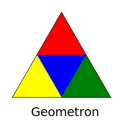

# Geometron Technical Paper Builder


Geometron technical paper builder page, which uses $\LaTeX$ via mathjax and showdown to convert from markdown to html, and bootstrap to make the fonts look nice in a mobile browser.

This is part of a system of self replicating nodes which includes "page", "symbol", and "map" as well as some others which are in progress.

The idea here is to create instant technical communication which can be shared with the whole scientific community, read on mobile devices, remixed and republished equally rapidly.  

To edit this file, click on the pencil icon.  


Equations look like this:

$$
\frac{-\hbar^2}{2m}\nabla^2\Psi + V\Psi = E\Psi
$$


Figures look like this:



To add new figures, put them in the figures/ directory, and the editor should then populate the scroll on the right side of the screen with that new figure. Click on it, and the markdown code to use that figure will appear in the "image code" field, which you can copy/paste into your manuscript.


[link to the code editor](editor.php)


Actions to do in this system:

- See the link to a new paper in some existing web feed such as Twitter, read it on your mobile phone
- make a local copy of a paper, edit it, remix it, publish your own with notes, as a form of extreme peer review
- use paper as a seed to build your own original paper in the same field
- push your paper link to a feed of new papers for sharing with others, using existing social media channels, using hashtags to track links on for example Twitter, facebook or some news reader feed
- convert paper from markdown to pure latex for peer review or archival publication or dissertation chapters
- import/export equation and figure information between Jupyter notebooks and Geometron technical paper system

To make a local copy of a paper, create your own new github repository for your paper on your local machine.  If you have a mac or many linux systems you'll already have php working, and you can use a Ubuntu terminal on PC if you have that working otherwise you can install MAMP to get php and local web server working on pc.  Copy the file replicator.php to your new local directory and run that either using a browser or the command line to replicate this from either github or some other existing instance out on the Web. 

With a local instance use either MAMP or run 

```
php -S localhost:8000
```

and point your browser to "localhost:8000".  

Now you should see this document and can edit it, make your new paper, read that, and then push it to github.  With your paper safely saved to Github, you can replicate it from there to anywhere on the Web by putting a new replicator.php file with your new url for your paper instead of the existing one in dna.txt inside replicator.php.  This dna file will grab all the utility files for this system as well as the README.md file which is the actual paper.  As soon as replicator.php runs you'll have a fully working, readable instance of your paper on a remote web page ready to be read by the whole world on any web browser on any device!


